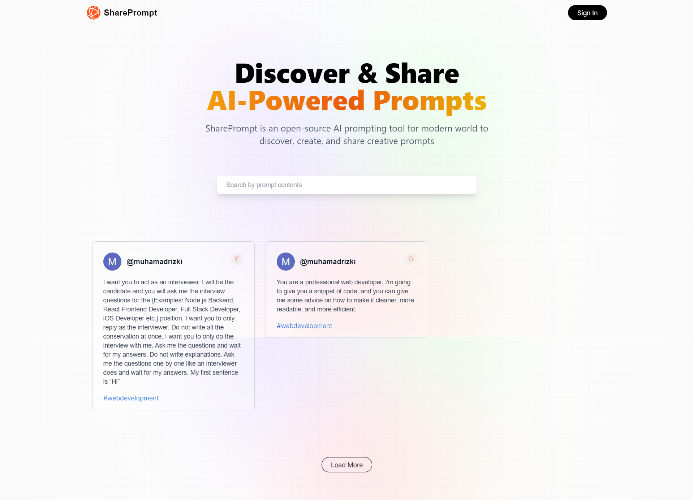

# Share Prompt (Javascript)

This is an open source AI prompting tool SharePrompt. This is a [Next.js](https://nextjs.org/) project bootstrapped with [`create-next-app`](https://github.com/vercel/next.js/tree/canary/packages/create-next-app).

[](http://localhost:3000)

> **Warning**
> This project is still in development and is not ready for production use.
>
> It uses new technologies (Next.Js 13 with app router, server component) which are subject to change and may break your application.

## Tech Stack

- [Next.js](https://nextjs.org)
- [Tailwind CSS](https://tailwindcss.com)
- [Next Auth](https://next-auth.js.org/)
- [MongoDB Atlas](https://www.mongodb.com/atlas)

## Feature to be implemented

- [x] Limitation create prompt for each account
- [x] Prompts Feed with lazy loading
- [x] Search by prompt (Via fetching API)
- [ ] View other profile

## First installation note

- What is your project named? ... share-prompt
- Would you like to use TypeScript? ... No
- Would you like to use ESLint? ... No
- Would you like to use Tailwind CSS? ... Yes
- Would you like to use `src/` directory? ... No
- Would you like to use App Router? (recommended) ... Yes
- Would you like to customize the default import alias? ... Yes
- What import alias would you like configured? ... @/* (press enter)

Creating a new Next.js app in \share-prompt.

## Getting Started

First, run the development server:

```bash
npm run dev
# or
yarn dev
# or
pnpm dev
```

Open [http://localhost:3000](http://localhost:3000) with your browser to see the result.

You can start editing the page by modifying `app/page.js`. The page auto-updates as you edit the file.

This project uses [`next/font`](https://nextjs.org/docs/basic-features/font-optimization) to automatically optimize and load Inter, a custom Google Font.

## Learn More

To learn more about Next.js, take a look at the following resources:

- [Next.js Documentation](https://nextjs.org/docs) - learn about Next.js features and API.
- [Learn Next.js](https://nextjs.org/learn) - an interactive Next.js tutorial.

You can check out [the Next.js GitHub repository](https://github.com/vercel/next.js/) - your feedback and contributions are welcome!

## Deploy on Vercel

The easiest way to deploy your Next.js app is to use the [Vercel Platform](https://vercel.com/new?utm_medium=default-template&filter=next.js&utm_source=create-next-app&utm_campaign=create-next-app-readme) from the creators of Next.js.

Check out our [Next.js deployment documentation](https://nextjs.org/docs/deployment) for more details.
